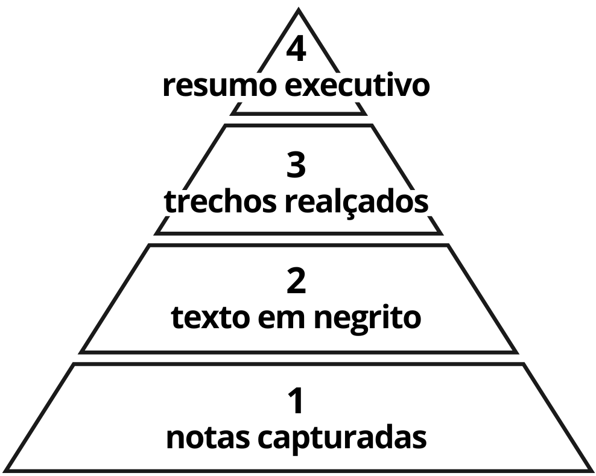
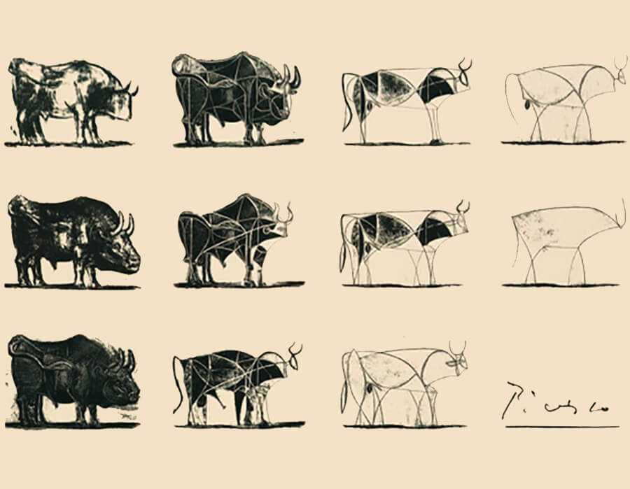
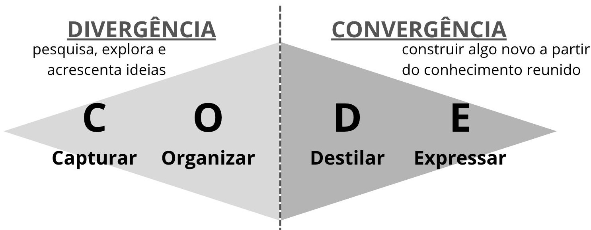

Recursos: [buildingasecondbrain.com/resources](buildingasecondbrain.com/resources)
## Trechos e Anotações

1. Essas experiências têm se tornado cada vez mais comuns à medida que aumenta a quantidade de informações a que temos acesso.

2. Para conseguir **aproveitar as informações** que mais valorizamos, precisamos **descobrir um jeito de empacotá-las e enviá-las para o nosso eu futuro**. **Tudo começa com o simples ato de anotar**.

3. Cada novo aplicativo de produtividade prometia uma inovação, mas em geral acabava se tornando mais uma coisa para gerir.

4. Seu sucesso profissional e sua qualidade de vida dependem diretamente de sua **capacidade de gerenciar informações de forma eficaz**.

5. "O que **a informação consome** é bastante óbvio: ela consome **a atenção** de seus destinatários. Portanto, **riqueza de informações gera pobreza de atenção**." - Herbert Simon

6. **Em vez de nos empoderar, esse dilúvio de informações nos oprime**. A sobrecarga de informações se transformou em **exaustão de informações**, esgotando nossos recursos mentais e **nos deixando constantemente ansiosos por achar que estamos esquecendo alguma coisa**. **O acesso instantâneo a todo o conhecimento do mundo por meio da internet deveria nos educar e nos informar, mas, em vez disso, criou uma pobreza de atenção em toda a sociedade**.

7. Estamos paralisados pelo conflito entre nossas responsabilidades e nossas paixões mais profundas, de modo que nunca conseguimos nos concentrar, mas também nunca conseguimos descansar.

8. A descoberta de Watson e Crick é bastante notória, mas há uma parte da sua história que pouca gente sabe: uma ferramenta importante que ajudou os pesquisadores a alcançar esse resultado foi a **construção de modelos físicos**, abordagem que eles copiaram do bioquímico americano Linus Pauling. Eles fizeram recortes de papelão para aproximar as formas das moléculas que sabiam fazer parte da composição do DNA e, tal qual um quebra-cabeça, experimentaram diferentes maneiras de montá-las. Foram mudando os modelos construídos nas mesas de trabalho, tentando encontrar uma forma que se encaixasse em tudo que sabiam sobre a disposição das moléculas. A estrutura de dupla hélice parecia funcionar em meio a todas as restrições conhecidas, permitindo que os pares de bases complementares se encaixassem perfeitamente ao mesmo tempo que respeitavam as proporções entre os elementos que haviam sido medidos anteriormente.1 Este é um aspecto curioso de uma das descobertas científicas mais famosas do século passado. **No momento decisivo, até os cientistas altamente treinados e familiarizados com o pensamento matemático e abstrato recorreram ao meio mais básico e antigo disponível: o material físico**. -> sobre Watson e Crick, que descobriram o modelo de 2 hélices do DNA

9. **Viés de recência: Costumamos favorecer as ideias, soluções e influências mais recentes, independentemente de serem as melhores**

10. Se você se sente **travado nas suas atividades criativas**, não há algo de errado com você. Você não perdeu o jeito ou a criatividade: **apenas não tem matéria-prima suficiente para trabalhar ainda**. Se você tem a sensação de que o poço da inspiração secou, é porque precisa de um poço mais profundo, cheio de exemplos, ilustrações, histórias, estatísticas, diagramas, analogias, metáforas, fotos, mapas mentais, anotações de conversas, citações – qualquer coisa que o ajude a fortalecer seu ponto de vista ou a lutar por uma causa na qual acredita.

11. **Não somos capazes de consumir todo esse fluxo de informações. Se tentarmos, ficaremos rapidamente exaustos e sobrecarregados**. Precisamos **agir como um curador**, nos afastando do rio caudaloso de informações e começando a tomar decisões pensadas sobre quais informações vamos querer na nossa mente.

12. A solução é **guardar apenas aquilo que repercute em você** <b><u>(CAPTURAR)</u></b> num lugar confiável, sob controle, e eliminar o resto.

13. Sempre que criar uma nota, pergunte-se: "Como posso tornar isso o mais útil possível para usar no futuro?" Você começará a anotar as palavras e frases que explicam por que criou a nota, em que estava pensando e o que exatamente chamou sua atenção. **Suas notas serão inúteis se você não conseguir decifrá-las no futuro ou se forem tão longas que você não vai sequer tentar**.

14. Talvez sejam necessárias centenas de páginas e milhares de palavras para explicar completamente uma ideia complexa, mas **sempre há uma forma de transmitir a mensagem principal em apenas uma ou duas frases**. Einstein ficou famoso por resumir sua nova e revolucionária teoria da física com a equação E = mc2. Se ele foi capaz de destilar todo o seu pensamento numa equação tão refinada, você certamente conseguirá resumir os pontos principais de qualquer artigo, livro, vídeo ou apresentação -> <b><u>Se Einstein foi capaz de resumir toda sua teoria em E=mc², você consegue resumir sua ideia em 1 ou 2 frases!</u></b>

15. **A informação só se torna conhecimento** – pessoal, incorporado, verificado – **quando é utilizada**. Você só ganha confiança naquilo que sabe quando tem certeza de que funciona. Antes disso, tudo não passa de teoria.

16. **O consumo excessivo de informações** – a ideia de que mais é melhor, de que nunca temos o suficiente – está no cerne da **insatisfação de muitas pessoas com a forma como elas gastam seu tempo na internet**. Em vez de tentar encontrar "o melhor" conteúdo, recomendo mudar o foco e **passar a fazer coisas**, o que é muito mais satisfatório.

17. **"Tudo que não for salvo será perdido." ("Everything Not Saved Will Be Lost.") – Mensagem da Nintendo exibida ao sair do jogo**

18. Assim como acontece com os alimentos que ingerimos, temos o direito e a responsabilidade de escolher nossa dieta de informações. **Você é o que você consome, e isso vale tanto para comida quanto para informações**.

19. A qualidade desse jardim do conhecimento vai depender da **qualidade das suas sementes**, por isso é importante semeá-lo apenas com as ideias mais interessantes, perspicazes e úteis que pudermos encontrar.

20. No mundo digital em que vivemos, muitas vezes o **conhecimento surge como “conteúdo”** – trechos de um texto, prints, artigos favoritados, podcasts ou outros tipos de mídia. Isso inclui o conteúdo que você coleta de fontes externas, mas também o que cria ao redigir e-mails, elaborar planos de projeto, fazer brainstormings e registrar seus pensamentos. -> O conhecimento não está só em livros e conhecimento técnico, mas também em tiktok, youtube e outras mídias. -> **"O conhecimento está em toda parte"**

21. Um ativo de conhecimento é qualquer coisa que possa ser usada no futuro para resolver um problema, economizar tempo, explicar um conceito ou aprender com a experiência passada.

22. Você tem que manter doze dos seus problemas favoritos constantemente presentes na sua mente. Sempre que você souber de um novo truque ou resultado, teste-o em cada um dos seus doze problemas para ver se ajuda. De vez em quando você vai ter sucesso e as pessoas dirão: "Como ele fez isso? Ele deve ser um gênio!" - Feynman (Nobel de Física)

23. **O valor de um conteúdo nunca é distribuído uniformemente ao longo dele**. Sempre há certas partes mais interessantes, úteis ou valiosas para cada um. Você pode **extrair apenas as partes mais relevantes** e salvá-las como uma nota sucinta.

24. Os melhores curadores são **exigentes na hora de selecionar o que entra em suas coleções**, e você também deve ser. Se você tentar guardar tudo que encontra, corre o risco de gerar uma montanha de informações irrelevantes para si mesmo no futuro.

25. Quanto mais econômico você for na hora de capturar, menos tempo e esforço serão necessários para organizar, destilar e expressar – as três próximas etapas do Método CODE (O ideal é que a captura **não seja superior a 10% do conteúdo original**)

26. Já percebi que as pessoas **costumam anotar ideias que já conhecem, com as quais já concordam ou que poderiam ter tido**. Nós, seres humanos, temos a tendência natural de buscar evidências que confirmem o que já acreditamos ser verdade, um fenômeno conhecido como "**viés de confirmação**". -> tentar sair da bolha

27. Definição simples para **"informação": aquilo que surpreende**. **Se você não está surpreso com alguma coisa, é porque em algum nível já sabia dela**.

28. Se você transformar a leitura e o aprendizado em experiências desagradáveis, com o tempo passará a evitá-las. O segredo para transformar a leitura num hábito é torná-la fácil e agradável.

29. Quando as pessoas geram ativamente uma série de palavras, como ao **falar ou escrever**, **mais partes do cérebro são ativadas, em comparação com a simples leitura** das mesmas palavras. Esse é o conhecido “**efeito de geração**”. Escrever é uma forma de “ensaiar” suas ideias, é como treinar os passos de uma dança ou praticar arremessos no basquete. -> **Ensine, expresse o que você aprendeu!**

30. Talvez o objetivo mais imediato de transpor o conteúdo da nossa mente e capturá-lo externamente seja escapar do que chamo de “**ciclo de reatividade**” – o looping infinito de urgência, indignação e sensacionalismo tão comum na internet

31. É importante que a **captura exija pouco esforço**, porque é apenas o primeiro passo.

32. O único modo de **saber se você está capturando as melhores ideias é tentar colocá-las em prática na vida real**.

33. Tharp chama sua abordagem de "a caixa". Toda vez que inicia um novo projeto, ela pega uma caixa de arquivo e a etiqueta com o nome dele. "A caixa me faz sentir que estou organizada mesmo quando ainda não sei que direção estou tomando. Também representa um compromisso. O simples ato de escrever o nome do projeto na caixa significa que comecei a trabalhar." - The Creative Habit, Tharp

34. **Ninguém questiona a importância de espaços físicos que nos deixem calmos e centrados, mas, quando se trata do espaço de trabalho digital, é provável que você tenha gastado pouco tempo para organizá-lo de modo a aumentar sua produtividade ou criatividade**. Como profissionais do conhecimento, passamos muitas horas por dia em ambientes digitais. Se você não assumir o controle desses espaços virtuais e moldá-los para dar suporte aos tipos de pensamento que deseja ter, cada minuto gasto nesses ambientes parecerá cansativo e incômodo.

35. **PARA** representa as quatro principais categorias de informação na nossa vida: **Projetos, Áreas, Recursos e Arquivos**. -> responder: **"Em qual projeto isso será mais útil?"**
	1. <b><u>Projetos</u></b>: no que **estou trabalhando agora**. Projetos incluem resultados de curto prazo pelos quais você está trabalhando ativamente agora. Precisa ter **começo, meio e fim**
		1. Projetos em andamento, pessoais, paralelos, etc
	2. <b><u>Áreas</u></b>: com o que estou comprometido a **longo prazo** (sem data de término definida) e que vamos refletir a todo momento
		1. Finanças (poupar 6 meses de gastos), saúde (perder 2kg), escrita (escrever um artigo)
		2. Embora não tenha uma meta ou um prazo, existe um **padrão desejável** nessas áreas (definido por você)
	3. <b><u>Recursos</u></b>: coisas que quero usar como **referência futura**. Pode incluir qualquer assunto sobre o qual você queira reunir informações.
		1. É basicamente tudo que não pertence a um projeto ou uma área
	4. <b><u>Arquivos</u></b>: coisas que **concluí ou suspendi**. Neles ficam quaisquer itens das três categorias anteriores que **não estejam mais ativos**

36. Uma das maiores tentações da organização é ser muito perfeccionista e tratar o processo todo como um fim em si mesmo. Existe algo inerentemente satisfatório na ordem, e é fácil se deter nela em vez de seguir em frente para desenvolver e compartilhar o conhecimento.

37. Saber com quais projetos você está comprometido no momento é fundamental para poder ter em mente o que é prioridade na semana, planejar seu progresso e dizer não a coisas que não são importantes.

38. Ao contrário do que acontece com sua casa ou garagem, **não há problema em guardar coisas digitais para sempre**, desde que elas não distraiam seu foco no dia a dia.

39. Projetos pessoais e metas de longo prazo parecem especialmente flexíveis, como se sempre fosse possível realizá-los mais tarde.

40. Existe um paralelo entre o sistema PARA e a organização de cozinhas. Tudo numa cozinha é projetado e organizado para dar suporte a um resultado: preparar uma refeição da maneira mais eficiente possível. Os arquivos são como o freezer: os itens ficam armazenados até que sejam necessários, o que pode ocorrer num futuro distante. Os recursos são como a despensa: podem ser usados em qualquer refeição que você fizer, mas enquanto não são necessários ficam guardados. As áreas são como a geladeira – itens que você planeja usar em breve e que deseja verificar com mais frequência. E os projetos são como as panelas e frigideiras no fogão – os itens que você está preparando no momento. Cada tipo de alimento é armazenado de acordo com a necessidade dele para o preparo das refeições que você deseja.

41. O problema é que é exatamente assim que a maioria das pessoas organiza seus arquivos e notas – **mantendo todas as notas de livros juntas só porque elas são de livros ou todas as citações juntas só porque são citações**. <b><u>Em vez de organizar as ideias de acordo com a origem, recomendo organizá-las de acordo com sua utilidade.</u></b>
	1. Imagina organizar todas as frutas (frescas, secas, sucos, congeladas) em um só lugar só pq são frutas, não faz o menor sentido. 

42. O objetivo de organizar nosso conhecimento é fazer progresso na busca dos objetivos, e não fazer um doutorado em criação e organização de notas. O melhor jeito de aplicar o conhecimento é por meio da execução.

43. as pessoas precisam de espaços de trabalho limpos para poder criar. Não somos capazes de alcançar o ápice do raciocínio ou trabalhar da melhor forma possível quando nosso espaço está lotado de “coisas” do passado. Por isto a etapa de arquivamento é tão crucial: você não perde nada e pode encontrar o que quiser pesquisando, mas precisa tirar tudo que não vai usar da sua frente e da sua mente.
	1. Observe a área de trabalho do computador, a pasta de downloads, a pasta de documentos, os favoritos, os e-mails ou as guias abertas do navegador

44. Certa vez, uma mentora me deu um conselho que sigo até hoje: avance a passos curtos e procure o caminho de menor resistência. O uso da força bruta – ficar até tarde no escritório, preencher cada minuto com produtividade – não era o caminho para o sucesso; era o caminho para o burnout.
	1. No sistema PARA, geralmente esse passo é criar pastas para cada um dos projetos ativos no seu aplicativo de notas e começar a preenchê-las com o conteúdo relacionado a eles.

45. Para aumentar o fator de descoberta das notas, você pode recorrer a um hábito simples que tinha na escola: **destacar os trechos mais importantes**.

46. A destilação está no cerne de toda comunicação eficaz. **Quanto mais importante for que seu público ouça e comece a agir, mais destilada sua mensagem precisará ser**. (TL;NR - Too Long; Not Read)

47. As quatro camadas da <b><u>Sumarização Progressiva</u></b>: 
	1. 1 é o "solo": o trecho capturado (de qualquer fonte) 
	2. 2 é o "petróleo": texto em negrito
	3. 3 é "ouro": trechos realçados (amarelo, sublinhado, itálico)
	4. 4 são as "joias": resumo executivo com suas próprias palavras
	   

48. Na verdade, essa é uma ótima forma de filtrar e reduzir o volume de notas que você cria – as melhores ideias e informações sempre permanecem na sua mente por algumas horas.

49. O **maior erro** que as pessoas cometem quando começam a **destilar** suas notas é **destacar coisas demais**.
	1. Cada camada de destaque **não deve incluir mais do que 10% a 20% da camada anterior**.

50. Picasso: O Touro -> Podar o bom pra trazer à tona o ótimo
	1. Sequência de imagens que ele criou para estudar a forma essencial de um touro
	2. Até a quarta imagem ele vai adicionando detalhes. Em cada etapa após a quarta imagem ocorre o processo de **destilação**
	3. Na última etapa já está um traço simples e contínuo mas que **continua conseguindo captar a essência do touro**
		   	1. Ele vai retirando tudo que é desnecessário para que **apenas o essencial permaneça**
		   	2. Por mais que pareça simples, para conseguir chegar nesse nível muito esforço foi feito
			   	1. <b><u>"Se eu tivesse tido mais tempo, teria escrito uma carta mais curta" - Blaise Pascal</u></b>
			   	2. O mesmo acontece em **documentários**, que é preciso captar muito material para depois ir cortando e deixar apenas o mais importante
    

51. Você sempre deve partir do princípio de que **as notas não serão necessariamente úteis até que elas provem o contrário**. Você não tem a menor ideia de quais serão suas necessidades, desejos ou tarefas no futuro. Isso o obriga a ser conservador no tempo gasto ao criar uma Sumarização Progressiva para suas notas e a **só colocar a mão na massa quando estiver praticamente certo de que vai valer a pena**.
	1. Outro **erro** comum é **criar um destaque sem um propósito em mente**
	2. É importante **guardar as notas**, mas deixe para **sumarizar quando** você realmente for **precisar dela** para evitar perder tempo criando um monte de nota sumarizada mas sem utilidade nenhuma
	3. A regra geral é que, **toda vez que “tocar” numa nota, você deve torná-la um pouco mais “descobrível” para o seu eu do futuro¹** – acrescentando destaques, um título, uma estrutura de tópicos ou comentários. É a ideia básica de que você deve sempre deixar a nota melhor do que quando a encontrou.
		1. ¹: **estimergia** -> deixar no ambiente "marcas" que facilitem seus esforços futuros (usada pelas colônias de formigas, que deixam um feromônio especial no caminho de onde está a comida para que outras formigas também encontrem) 

52. Confie na sua intuição para lhe dizer quando uma passagem é interessante, contraintuitiva ou importante.
	1. **Não dificulte a criação de destaques**

53. Quando surge a oportunidade de fazermos nosso melhor trabalho, não é hora de começar a ler livros e fazer pesquisas. Você precisa que essa pesquisa já esteja feita. (você precisa ter referências, se sua sumarização tiver boa ela vai estar de fácil acesso pra ser usada)

54. 💭 Uma boa **sumarização progressiva** deve deixar **o conteúdo capaz de ser entendido** (o que é aquela nota e o que está ali) **em no máximo 30 segundos**.

55. **"Verum ipsum factum." ("Só sabemos o que fazemos.")** -> Se expresse, compartilhe seu trabalho!

56. Butler adorava usar fatos para que suas histórias tivessem um senso de autenticidade: **“Quanto menos você sabe sobre um assunto, mais precisos devem ser os dados que afirma”**

57. "As experiências dolorosas, terríveis e desagradáveis afetam meu trabalho mais do que as experiências agradáveis. Elas são mais memoráveis e me instigam a escrever mais histórias interessantes." - Octavia Butler (autora de )

58. O mito do escritor sentado diante de uma página em branco – ou do artista diante de uma tela em branco – é apenas isso mesmo, um mito. **Os profissionais criativos recorrem constantemente a fontes externas de inspiração**. Se existe um segredo para a criatividade, é que ela emerge do esforço cotidiano de **reunir e organizar nossas influências**.

59. **A atenção é o nosso recurso mais escasso e precioso**. -> a economia da atenção

60. A capacidade de alocar nossa atenção de maneira intencional e estratégica é uma **vantagem competitiva num mundo com tantas distrações**.

61. Aprendemos que é importante trabalhar “com o objetivo em mente”. Dizem que nossa responsabilidade é entregar resultados, seja na forma de um produto nas prateleiras das lojas, de um discurso em um evento ou de um relatório técnico. Em geral esse é um bom conselho, mas ao focar apenas nos resultados finais estamos cometendo uma falha: todo o trabalho intermediário – as notas, os rascunhos, os esboços, o feedback – tende a ser subestimado e desvalorizado. A preciosa atenção que investimos na produção desse trabalho intermediário é descartada e nunca mais usada. Como gerenciamos a maior parte do “trabalho em processo” dentro da nossa cabeça, assim que concluímos o projeto e saímos da nossa mesa todo o conhecimento valioso que tanto nos esforçamos para adquirir se dissolve na memória como um castelo de areia levado pelas ondas do mar.

62. 💭 da mesma forma que na escola as vezes estudamos pra prova e depois esquecemos tudo, na vida as vezes consumimos conteúdo imediato para produzir algo mas que rapidamente vai ser esquecido. 
	1. **Pense como se tivesse separando algo pra mandar pra uma outra pessoa** (**você quer escrever algo legal mas não quer perder tempo escrevendo**). 
	2. Pensa também **como você gostaria de receber algo** (você não quer gastar tanto tempo lendo). 
	3. **Agora junta esses dois**: você vai <b><u>escrever pro seu eu do futuro</u></b> (**o quão legal o seu eu do presente vai ser com seu eu do futuro?**) 

63. 💭 Parando pra pensar, <b>as pessoas mais legais que eu já conheci são as que tinham <u>repertório</u></b>. Outro dia o pessoal do trabalho atrasou pra reunião e eu fiquei conversando sobre fofoca com o cara que eu nem conhecia

64. Você **não pode ficar esperando até que tudo esteja perfeitamente pronto para só então compartilhar o que sabe**. Expresse suas ideias antes, com mais frequência e em **partes menores**, para testar o que funciona e coletar o feedback de outras pessoas.

65. 💭 **Apresentar ideias ainda não finalizadas** para os outros faz com que as pessoas fiquem **mais confortáveis em criticar sabendo que não é o produto final!**

66. **"Pacotes Intermediários" (PIs)**. Os PIs são os **blocos de construção concretos e individuais que compõem seu trabalho**.
	1. Fazer projetos menores permite que se faça progresso em qualquer intervalo de tempo

67. Nosso tempo e nossa atenção são escassos, e é hora de tratarmos tudo aquilo em que investimos como ativos de conhecimento que podem ser **reutilizados** em vez de reproduzi-los do zero toda vez.

68. Sempre cite as fontes e dê crédito aos autores. Um cientista não esconde suas fontes – ele as aponta para que outros possam refazer seus passos.

69. Grandes projetos e metas se tornam menos intimidantes porque você pode simplesmente **dividi-los em pedaços cada vez menores**, até que se encaixem nas lacunas do seu dia.
	1. Permite coletar feedbacks e errar mais rápido e com mais frequência

70. **Métodos de recuperação**:
	1. **Pesquisa**: busca direto no aplicativo
	2. **Navegação**: ter os arquivos em um sistema de pastas que seja útil e prático (que contenham pistas contextuais)
		1. Esse tipo de navegação usa partes mais antigas do cérebro que se desenvolveram para navegar em ambientes físicos e, portanto, é mais natural para nós.
		2. Também é possível colocar **links para outros arquivos**
	3. **Tags**: conseguem fazer com que seu Segundo Cérebro crie **conexões**, facilitando a visualização de temas e padrões interdisciplinares
	4. **Serendipidade**: é quando você encontra algo bom, útil ou interessante **por acaso**, sem estar procurando diretamente por aquilo
		1. Não é algo que pode forçar, mas é bom estar preparado e ter a base para quando acontecer
		2. Quanto mais referências buscarmos, maior a chance de encontrarmos algo "por acaso"
		3. É favorecida quando **mostramos ideias para outras pessoas** (não sabemos o que vai vir)
			1. O feedback faz a gente usar não só nosso primeiro e segundo cérebro, mas também o cérebro dos outros

71. "Só inicie projetos que já estejam 80% concluídos." -> já faça PIs que componham seus projetos futuros e quando perceber que já tem bastante coisa comece o projeto efetivamente

72. A transformação vem do fato de que essas **partes menores são mais compartilháveis e colaborativas por natureza**. É muito mais fácil mostrar a alguém uma parte pequena do trabalho e pedir uma opinião do que apresentar o trabalho inteiro.

73. “eu sabia por instinto que apenas enviar um artigo longo para os amigos geralmente não adiantava de nada, mas como o texto que enviei tinha trechos destacados por mim, eles podem passar os olhos no texto e encontrar rapidamente as partes mais importantes"
  
74. A dificuldade fundamental do trabalho criativo é que geralmente estamos muito próximos dele para enxergá-lo com objetividade.

75. É muito mais fácil **reunir e sintetizar os pensamentos dos outros do que apresentar uma série interminável de ideias geniais de sua autoria**. Você começa a se enxergar como o **curador do pensamento coletivo** de sua rede de contatos, e não como um criador de ideias solitário.

76. Aspecto importante da <mark><b>criatividade</b>: ela é sempre uma <b>montagem de partes já existentes</b></mark>. Todos nós nos baseamos em trabalhos já feitos. Ninguém cria nada do zero.
	1. Não utilize o trabalho inteiro dos outros, apenas aspectos ou partes dele.
	2. Sempre cite todas as suas fontes e influências, mesmo que não seja obrigatório. Dar crédito não diminui o valor do seu trabalho, só aumenta.

77. **Ideias são apenas pensamentos até que você as coloque em prática**. E pensamentos desaparecem com o tempo. -> para concretizar uma ideia é preciso fazer e **nós aprendemos fazendo!**

78. Ao identificarmos os princípios que resistem ao teste do tempo, apesar das grandes mudanças tecnológicas, podemos entender melhor a natureza essencial da criatividade.

79. No modo de **divergência**, você deve **abrir seus horizontes e explorar todas as opções possíveis**. No modo de **convergência**, feche a porta, coloque fones de ouvido com cancelamento de ruído, **ignore todos os novos dados e persiga ferozmente a doce recompensa da conclusão**. Acredite que você já tem ideias e fontes suficientes, volte-se para dentro e corra em direção ao seu objetivo.
	1. **Divergência:**
		1. O propósito é gerar ideias, então o processo é necessariamente **espontâneo, caótico e confuso**
		2. Se passarmos o tempo todo divergindo nunca chegaremos a lugar algum

80. Explicando o **método CODE**:
    

81. É doloroso cortar opções e escolher um caminho em detrimento de outro. **É triste ver uma ideia que você sabe que tem muito potencial ser cortada** de um roteiro ou história. É isso que torna o trabalho criativo tão desafiador.
	1. Elas são cortadas mas seguindo esse método de organização **elas não são perdidas!**

82. Cada capítulo nasce como uma espécie de arquipélago de citações inspiradoras, o que torna a tarefa muito menos assustadora. Tudo que tenho a fazer é construir pontes entre as ilhas. - Steve Johnson sobre o Arquipélago de Ideias
	1. Ao começas, ao invés de olhar pra um papel em branco, ele olha pra um documento cheio de citações: de cartas, fontes primárias, artigos acadêmicos, próprias notas
	2. Depois o que ele tem que fazer é conectar essas ideias

83. O **Arquipélago de Ideias** separa as duas atividades que seu cérebro tem mais dificuldade em realizar ao mesmo tempo: **escolher ideias (seleção) e organizá-las num fluxo lógico (sequenciamento)**.

84. "**Ponte de Hemingway**": ele só **terminava uma sessão de escrita quando já sabia o que aconteceria a seguir na história**. Assim, quando voltava a trabalhar, sabia exatamente por onde começar. -> deixar algo para seguir no próximo dia
	1. ele parava quando o próximo ponto da trama ficava claro. Assim, quando voltava a trabalhar na história, sabia exatamente por onde começar.
	2. Sugestões:
		1. Anote ideias para os próximos passos
		2. Anote todos os detalhes que você tem em mente e que provavelmente vai esquecer assim que parar de trabalhar.
		3. **Anote sua intenção para a próxima sessão de trabalho**. Estabeleça uma intenção para o que planeja fazer a seguir, o problema que pretende resolver ou o marco que deseja alcançar.

86. **💭 muitas vezes não vamos estar em um foguete caro e com um motor super potente (dinheiro dos investidores), mas sim em um balão onde precisamos jogar fora toda a carga desnecessária para que ele possa subir!**

87. O problema não é correr contra o tempo, mas perder a noção de que temos controle sobre o escopo do projeto. Podemos "reduzir" para algo mais viável de concluir.

88. 💭 **Não controlamos o tempo** que temos disponível, **mas controlamos o escopo** do nosso projeto. -> não necessariamente precisa jogar tudo fora, talvez só não seja um escopo de agora

89. Isso não significa que você tenha que jogar essas partes fora. Uma das melhores funções do Segundo Cérebro é reunir e guardar as sobras, caso você queira usá-las em outro lugar.

90. Saber que **nada** do que escrevo ou crio **realmente se perde – é apenas salvo para uso posterior** – me dá confiança para fazer cortes agressivos nos meus trabalhos criativos sem medo de desperdiçar esforços.

91. Não importa o que você esteja construindo: existe uma versão menor e mais simples, capaz de oferecer grande parte do valor total numa fração do tempo.

92. "Qual é a menor versão disso que eu posso produzir para obter um feedback útil de outras pessoas?"
	1. peça feedback de seu rascunho, sua versão beta ou sua proposta. Compartilhe esse PI e peça opiniões

93. O famoso problema do ovo e da galinha aplicado à criatividade: **você não sabe o que deve criar, mas não vai descobrir o que as pessoas querem até criar algo**.

94. Chefs não podem se dar ao luxo de parar tudo apenas para limpar a cozinha. Eles aprendem a **manter o local de trabalho limpo e organizado** enquanto preparam as refeições.
	1. Usam o mise-en-place: **Mise-en-place** é uma expressão francesa usada principalmente na cozinha e significa algo como “tudo no seu lugar”. Na prática, é o ato de preparar e organizar tudo antes de começar.

95. Manter um inventário de suas vitórias e sucessos é um uso maravilhoso do Segundo Cérebro.

96. Grande parte do nosso trabalho é **repetida ao longo do tempo**, com pequenas variações. A ideia é que, se você começar a pensar de onde parou da última vez, estará muito mais à frente do que se começasse do zero.
	1. Sempre que possível também revise seus PI's pra lembrar se algo ali pode ser útil

97. Revisão Semanal: registrar novas tarefas, revisar projetos ativos e determinar as prioridades para a próxima semana.

98. É importante que a lista de projetos seja sempre um reflexo atual, oportuno e preciso de seus objetivos e prioridades da vida real.

99. **🌟 Se você esperar o momento perfeito, nunca dará o primeiro passo. 🌟**

100. Hoje o grande desafio é encontrar maneiras de interromper o fluxo de informações que chegam, para então podermos fazer algo.

101. **O paradoxo da acumulação é que não importa o quanto você colete e acumule – nunca é o suficiente**.

102. O objetivo do conhecimento é ser compartilhado. Aprender não significa acumular conhecimento, tal como se fossem moedas de ouro. Ele é o único recurso que fica melhor e mais valioso à medida que se multiplica.

103. Existem pessoas que **só você pode alcançar**.
	1. Que se não for por você, talvez nunca tenham acesso a esse conteúdo!
	2. Comentário meu mesmo: e na internet tá com tanta gente compartilhando um monte de coisa ruim, pq não tentar compartilhar algo legal não é mesmo?

104. **"Paradoxo de Polanyi": "Sabemos mais do que podemos dizer."**
	1. não somos capazes de explicar plenamente muitas tarefas que podemos realizar com facilidade
	2. Podemos tentar mas as explicações nunca são completas -> conhecimento tácito

105. Esse problema – conhecido como "autoignorância" – tem sido um grande obstáculo no desenvolvimento da inteligência artificial. Tendo em vista que não somos capazes de descrever como sabemos o que sabemos, não podemos transpor esse conhecimento para um software. -> hoje com redes neurais parte disso já é contornável (mas não aprofundaremos nisso)

106. Os trabalhos e empreendimentos que dependem do conhecimento tácito serão os últimos a serem automatizados.

107. 💭 pede uma pessoa para explicar como ela anda. ela sabe andar muito bem mas não consegue colocar em palavras (e muito menos em regras) como ela faz isso

108. Para saber o que armazenar, comece percebendo o que repercute em você. Preste atenção naquilo que o atrai no mundo exterior.
	1. Você procura fora de si para procurar dentro de si, tendo a certeza de que tudo que encontrar sempre fez parte de você.

109. "O mundo está desesperado para ouvir o que você tem a dizer. Compartilhar com as pessoas pode mudar vidas." - Livro

110. Criar uma classificação de tags "perfeita" leva muitas pessoas a gastar horas e horas tentando criar uma taxonomia abrangente de tags que se aplicará a qualquer conteúdo futuro que capturarem. Mas, na minha experiência, esse exercício é inútil. 
	1. Etiquetando cada nota com todos os tópicos com os quais ela pode se relacionar – tem falhas graves.
	2. À primeira vista, talvez pareça uma forma eficaz de revelar todas as conexões entre as notas, o problema dessa abordagem é que ela exige que você gaste muita energia tomando uma série de decisões mentalmente desgastantes antes mesmo de saber se e como a nota será de fato usada no futuro.
		1. Criar uma taxonomia abrangente de tags que se aplicará a qualquer conteúdo futuro é inútil na maioria das vezes.

111. A tecnologia de busca avançou tanto que hoje cada palavra de uma nota é uma palavra-chave. (então não é preciso gastar tanto tempo com tags)

112. Para usar tags, algumas sugestões são:
	1. Crie **tags personalizadas** para os usos que você pretende dar às notas.
	2. Use **tags para acompanhar o progresso** (conceito do **jardim digital**)
	3. Etiquete as notas retroativamente e **apenas quando necessário**

113. Pergunte a si mesmo: "Como costumo usar o conteúdo que capturo?"
	1. Etiquetagem de acordo com o produto final, com o tipo de informação, com o papel dentro do projeto e até como o estágio atual

114. Esta é a situação perfeita para tags: quando você quer **uma forma diferente de "visualizar" as notas sem precisar reorganizar o sistema inteiro**.

115. As tags permitem que você veja um corte transversal de suas notas a partir de uma perspectiva diferente das categorias do sistema PARA.
	1. 💭 cria uma nova organização sem precisar mudar as notas de pastas

116. <b>As tags precisam ser <mark>simples o suficiente para ser usado de forma consistente e útil o suficiente para valer o esforço de usá-las</mark></b>

117. Em vez de aplicar tags nas notas no momento em que captura o conteúdo, recomendo aplicá-las na hora de usar o conteúdo de fato.

118. **A grande magia das informações digitais é que, após a captura, é fácil alterá-las**.

119. Se você quer adotar novos comportamentos, não existe nada mais eficaz do que se cercar de pessoas que já os têm.

## Resumo:
- Método **CODE**:
	- **Capturar**: **guarde** o que repercute em você
	- **Organizar**: deixe de forma a ter **acionabilidade**
	- **Destilar**: encontre a **essência** (destacar o que importa!)
	- **Expressar**: **compartilhe** seu trabalho
- As informações são **salvas** sendo colocadas em 4 locais:
	- **Projetos**: Esforços de curto prazo, nos quais está trabalhando agora
	- **Áreas**: Responsabilidades de longo prazo que você deseja gerir ao longo do tempo
	- **Recursos**: Temas ou interesses que podem ser úteis no futuro
	- **Arquivos**: Itens inativos das outras três categorias