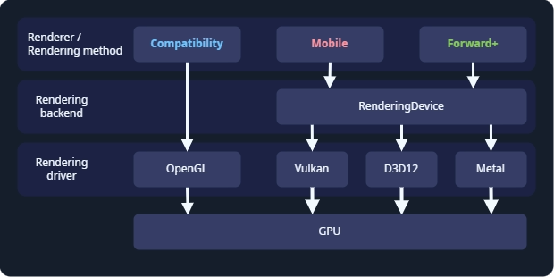
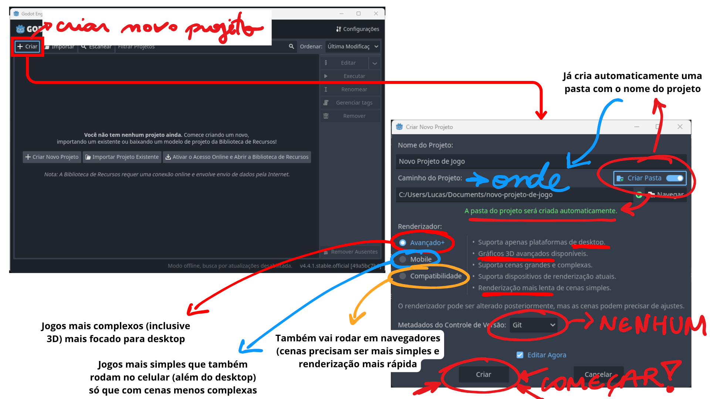
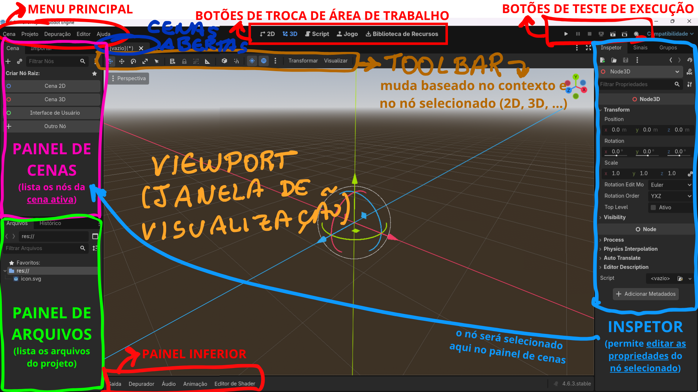

# Instalação
- Acessar: **[godotengine.org](https://godotengine.org/download/)**
- Tem 2 versões: 
	- **Padrão**: para **uso de GDScript** (linguagem própria)
	- **.NET**: para quem tem experiência com C#
- A GODOT não tem instalação, **é portátil** 
	- É só extrair o zip e executar o arquivo **`.exe`**
	- Tem 2 versões, a **normal (que geralmente usamos)** e a **`_console`** (abre um terminal junto) 

# Primeiro projeto
- Clicar em **`+ Criar`**
- Colocar o **nome do projeto** (ele já atualiza o `Caminho do Projeto` automaticamente)
- Definir o **`Renderizador`**
	- **Avançado+**: permite muito **mais complexidade no desenvolvimento** (até 3D complexo) mas apenas para plataformas de **desktop**
	- **Mobile**: Desktop + **mobile** mas é **menos escalável para cenas complexas / 3D**
	- **Compatibilidade**: também roda **web** porém com menos recursos, tem renderização bem mais rápida de cenas simples. Usa renderizador **OpenGL 3**
	  
	 
		- A própria Godot faz todo o trabalho pra exportar pra qualquer plataforma que seja (Windows, Linux, Mac, iOS, etc)

- Clicar em **`Criar`**
  

- Ao criar, basicamente teremos algumas **áreas importantes** na GODOT:
	Ver também: https://docs.godotengine.org/pt-br/4.x/getting_started/introduction/first_look_at_the_editor.html#first-look-at-godot-s-editor
	
	